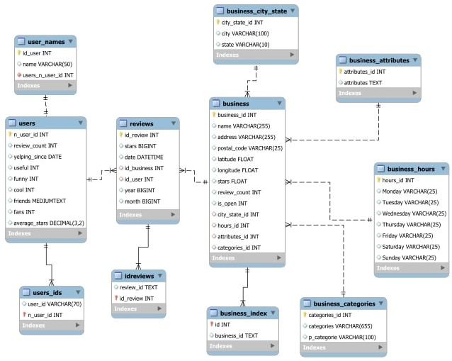
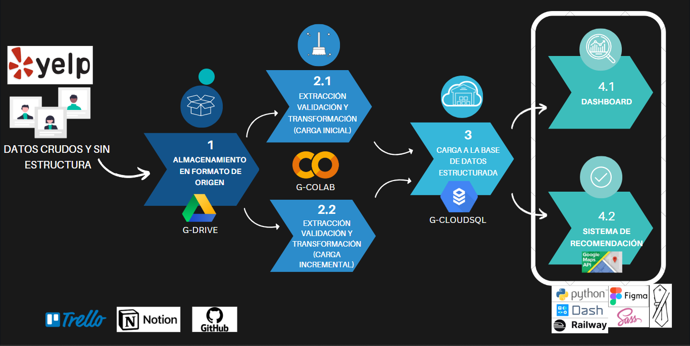

 <h1>PROYECTO FINAL -PLUS YELP</h1> 

 “Connect and simplify big data to make the best investment decisions.”
 

[comment]: <> (> **Note** )
[comment]: <> (> This README file is written in Spanish. To go to the English version [click here])
[comment]: <> (README_EN.md. el nombre de este nombre de archivo debe ir en parentesis redondos) 

**Tabla de Contenido:**
---
- [Descripción del proyecto](#descripcion-del-proyecto-)
proposito, breve descripción y alcances 
- [Equipo](#equipo-)
- [Archivos](#el-repositorio)
lista de archivos y descripcion de funcionalidad
- [Datos](#datos)
fuente y  link a diccionario  de datos de datos en bruto
transformación y validación de datos utilizados
- [Pipeline y Stack tecnológico](#pipeline)
descripcion de pipeline, der
- [Dashboard para toma de desiciones de inversión](#dashboard-para-toma-)

- [Sistema de recomendación de restaurantes](#sistema-de-recomendacion)

# Descripción del proyecto 

Este proyecto se creó para que empresarios y emprendedores puedan identificar oportunidades de inversiones en el rubro del ocio(restaurantes, bares, hoteles, entre otros) utilizando información extraida de la opinión de clientes sobre los bienes o servicios prestados por decenas de miles de negocios ubicados en estados unidos y adicionalmente se aprovechó esta gran cantidad de datos para construir un sistema de recomendación de restaurantes para clientes que busquen nuevas experiencias de consumo. 

## Objetivos:
- Identificación de categorías y características de negocios con alto potencial de aceptación y por tanto de crecimiento y con bajo riesgo de cierre.
- Identificación de localizaciones convenientes para instalar un nuevo local.
- Diseño de un sistema de recomendaciones para usuarios sin y con historial de consumo y reseñas.

## Alcance:
- Extracción, transformación o limpieza, validación y almacenamiento estructurado de los datos.
- Creación y despliegue de un dashboard como web app como herramienta de visualización de la información extraida del análisis de los datos para la toma de desición de inversión e identificación de localización(a nivel estado) para asentar un nuevo local.
- Creación y despliegue como web app de un sistema de recomendación de restaurantes para consumidores.

# Equipo 
- Julio Gutierrez, [CesarG2022](https://github.com/CesarG2022)
- Erick Mamani [khorneflakes-dev](https://github.com/khorneflakes-dev)
- Jonathan Santacana [JCSR2022](https://github.com/JCSR2022)

# Archivos 

- carpeta ETL
    - Creacion_archivos_carga_incremental.ipynb : notebook para hacer la división de los datasets iniciales en datasets para carga inicial, carga incremental e incremental para pruebas de validación.
    - ETL.ipynb : Notebook para la extracción, transformación, carga a base de datos SQL de los datos de los usuarios de yelp y para creación del modelo entidad relación.
    - Incremental_load.ipynb : notebook para la transformación, validación y carga incremental de los datos de nuevas reseñas y usuarios a la base de datos.
- carpeta Web_App:
    - requirements.txt : archivo para instalar en el ambiente virtual las librerías necesarias. 
    - app.py : script para hacer el despliegue de la web app que contiene la página del dashboard y la página del sistema de recomendación. 
    - Carpeta pages :
        - trending.py : script con el código de la pestaña de tendencias(Trends) del dashboard.
        - risk.py : script con el código de la pestaña de riesgos(risks) del dashboard.
        - opportunities.py : script con el código de la pestaña de oportunidades(opportunities) del dashboard.
        - users.py : script con el código de la página  del sistema de recomendación de restaurantes

# Datos

Los datos sobre reseñas, usuarios y empresas, fueron obtenidos de el [dataset abierto](https://www.yelp.com/dataset) para propósitos de aprendizaje de la app Yelp que cuenta con cerca de 7 millones de reseñas realizadas por aproximadamente 2 millones de usuarios sobre el servicio y/o producto ofrecido por un poco mas de 150 mil empresas de 13 estados de EEUU.

# Pipeline y Stack Tecnológico 

## Almacenamiento en bruto y División de los datos
En esta etapa se alamacenan los datasets de yelp en bruto en google drive en la carpeta "Dataset Yelp" y se dividen los archivos en bruto user.json, business.json y review.json en tres nuevos sets de archivos .json, esto se logra ejecutando el notebook "Creacion_archivos_carga_incremental.ipynb" el cual automáticamente crea la carpeta  pruebas_incremental con los siguientes archivos:
1) Archivos de carga inicial: user_inicial.json, business_inicial.json, review_inicial.json.
2) Archivos para carga incremental batch: user_incremental_#.json, donde # es un entero entre 0 y 7,
business_incremental.json y review_incremental#.json donde # es un entero entre 1 y 29.
3) Archivos para carga incremental con errores a creados a propósito para evaluar filtros de validación de formato y de datos duplicados: user_aleatorio.json, user_incremental_con_repeticiones#.json donde # es 8 o 9, business_aleatorio,json, business_incremental_con_repeticiones.json y review_aleatorio.json, review_incremental_con_repeticiones#.json donde #=[30,34]. 

## Extracción, transformación y carga a la base de datos
los datasets divididos y almacenados en drive se convierten en dataframes con la librería pandas y se transforman, validan y estructuran para extraer los datos útiles y consistentes para el análisis y el sistema de recomendación. El ETL de las cargas incrementales tiene variaciones a causa de las validaciones adicionales necesarias por lo que esta etapa se divide en dos:
- ETL Carga inicial: se realiza ejecutando el archivo ETL.ipynb en colab, esta proceso se centra en seleccionar las columnas útiles, dar el formato adecuado para que no ocupe mas espacio en memoria del necesario, aspecto importante dado el gran tamaño de los datos, filtrar duplicados, rellenar faltantes, corregir errores de escritura, y crear las tablas, sus claves y las conexiones entre estas con la estructura necesaria para almacenarlas en SQL de manera óptima. 
- ETL Carga incremental: se realiza ejecutando el archivo Incremental_load.ipynb en colab, adicional a las transformaciones que se realizan en la carga inicial, en este proceso se comprueba que los archivos nuevos tengan el mismo formato de los archivos iniciales y se filtran las reseñas y/o usuarios que ya se encuentran en la base de datos.
En ambos casos, carga inicial e incremental se realiza la carga a la base de datos cloudsql (la DB SQL en la nube de google) usando SQLalchemy. 

El modelo entidad relación construido para almacenar los datos se muestra a continuación:

  

## Uso de los datos para el dashboard y el sistema de recomendación
una vez seleccionados, limpiados y almacenados en el datawarehouse cloudsql, los datos son extraídos para el análisis y el sistema de recomendación usando scripts de python con la librería SQLalchemy. Para el despligue se utilizaron los frameworks dash para construir las gráficas interactivas y flask para el despliegue como web app en la plataforma railway, para el sistema de recomendación de utilizó adicionalmente la API de google Maps para ofrecer la ubicación de los restaurantes recomendados. El script para activar el despliegue de la web app es app.py.

En la siguiente figura se muestra el diagrama del pipeline y el stack tecnológico utilizado.

  

# Dashboard para toma de desiciones de inversión 

El modelo para el análisis e identificación de opciones y ubicación de inversiones con potencial de alto retorno, se enfocó en la búsqueda de negocios y características de negocios(categoría, subcategoría, localización y atributos) guiada por los siguientes tres aspectos clave:
1) Alta probabilidad de aceptación por parte de los clientes. 
2) Bajo riesgo de cierre. 
3) Oportunidad de cubrir demanda insatisfecha (baja satisfacción y extenso tamaño de mercado). 

Para lograr la identificación se definieron los siguientes 4 índices de rendimiento claves:

1) Variación anual de negocios reseñados positivamente (%VAN): Este KPI refleja el aumento en el tiempo en la apertura de nuevos negocios o la disminución de negocios existentes con buena recepción por parte del público o mercado objetivo, se calcula así:
$$
\% VAN = \frac{N_{i} - N_{i-1} }{N_{i-1}} * 100
$$
&emsp;&emsp;&emsp; donde:  
$$  
i = \text{año} \\
N_{i} = \text{cantidad de negocios con calificación promedio >=4 del año i} 
$$ 

2) Tiempo promedio de vida del cliente (TVC): este indicador mide el lapso en meses entre el primer y último comentario de los clientes y es por tanto un reflejo de la retención de sus clientes, se calcula así:
$$
TVC = prom\left(\left(\text{fecha de último review}\right) - \left(\text{fecha de primer review}\right)\right)
$$

3) Porcentage de negocios cerrados (%NC): Este KPI indica la estabilidad del o los negocios, se calcula de la siguiente manera:
$$
\% NC = \frac{N_{c}}{N_t} *100      
$$
&emsp;&emsp;&emsp; donde:  
$$  
N_{c} = \text{cantidad de sucursales cerrados.} \\
N_{c} = \text{cantidad total de sucursales.} 
$$ 

4) Estrellas promedio de las reseñas(PE): Este KPI es la métrica que muestra de manera mas exacta la satisfacción del cliente con el servicio y/o producto ofrecido por el negocio.
    
Por lo anterior el dashboard se divide en las siguientes tres secciones: 
- Tendencias(Trending): Esta página esta diseñada para permitirle al inversor identificar el estado en el que debe invertir en un negocio o localizar una nueva sucursal mediante un mapa de EEUU de acuerdo con la satisfacción del cliente (PE) y un mapa(matriz) de calor con la variación temporal de negocios reseñados positivamente (%VAN), además de indicarle mediante wordclouds las subcategorías(sandwiches, american traditional, wine, tours, nails, ....) y los atributos(bike parking, accept credit card, good for kids....) con mayor prevalencia en los rubros o negocios con mejores indicadores. Adicionalmente muestra listas top ten de negocios de acuerdo con los indicadores de retencion(TVC) y satisfacción del cliente(PE). Esta página cuenta con filtros de estado(dando click al estado) y categoría principal(lista desplegable con opciones: restaurants, hotel & travel, beauty & spa, night life, active life, food, arts & entertainment) sobre todos los objetos de la página lo cual permite realizar una búsqueda de tendencias segmentada.

- Riesgos(Risk): En esta página se pueden identificar en el mapa de EEUU los estados con mayor riesgo de cierre(%NC), en una lista top ten los negocios con mas sucursales y su riesgo de cierre  y la evolución historica del riesgo de cierre para cada una de las categorías principales o rubros estudiados. Para la extracción de información segmentada, el mapa cuenta con filtro de categoría, el top ten cuenta con filtro de categoría y estado y la gráfica de evolución histórica de cierre por categoría cuenta con filtro de estado.

- Oportunidades(Opportunities): Para identificar demanda insatisfecha, se creó la métrica rev_cat_pob que toma valores entre 0 y 100% dependiendo de la fracción de calificaciones negativas(<=3) respecto al total de calificaciones y del tamaño de la población en la localidad, de tal manera que a mayor fracción de calificaciones negativas y a mayor cantidad de población, mayor el valor de rev_cat_pob. En esta página se pueden identificar en el mapa de EEUU los estados con mayores oportunidades para cubrir demanda insatisfecha, asi como en las tablas se pueden identificar negocios y sus ubicaciones(ciudad y dirección) de tal manera que se pueda localizar una sucursal cerca que pueda captar los clientes descontentos. en esta pagina tambien es posible realizar busquedas segmentadas por estado y por categoría principal.

# Sistema de recomendación de restaurantes 
El sistema de recomendación se construyó para poder dar recomendaciones tanto a usuarios antiguos como nuevos.
En el caso de los antiguos, el sistema esta basado en contenidos, esto significa que mediante operaciones matriciales se calcula una calificación de recomendación para cada uno de los restaurantes en la ciudad en la que se encuentra localizado el usuario, basada en la confluencia de las sub-categorías(pizza, mexican, chinese,...) del restaurantes con las sub-categorías preferidas por el usuario, las cuales se obtienen de sus reseñas posítivas. Finalmente se listan los restaurantes con mayor calificación de recomendación y se presentan al usuario junto con los horarios de atención, la dirección, estrellas promedio y cantidad de reseñas de otros usuarios y la opción de ver la ubicación del restaurante en un mapa provisto por la API de google Maps.
Para los usuarios nuevos  el sitema de recomendación se basa en popularidad, es decir presenta al usuario una lista de restaurantes en la misma ubicación del usuario ordenada por las estrellas promedio y la cantidad de reseñas del restaurantes. 

